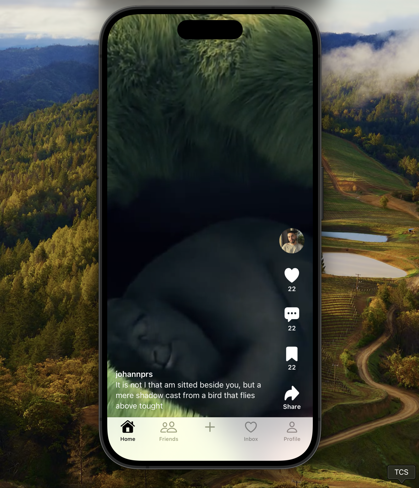
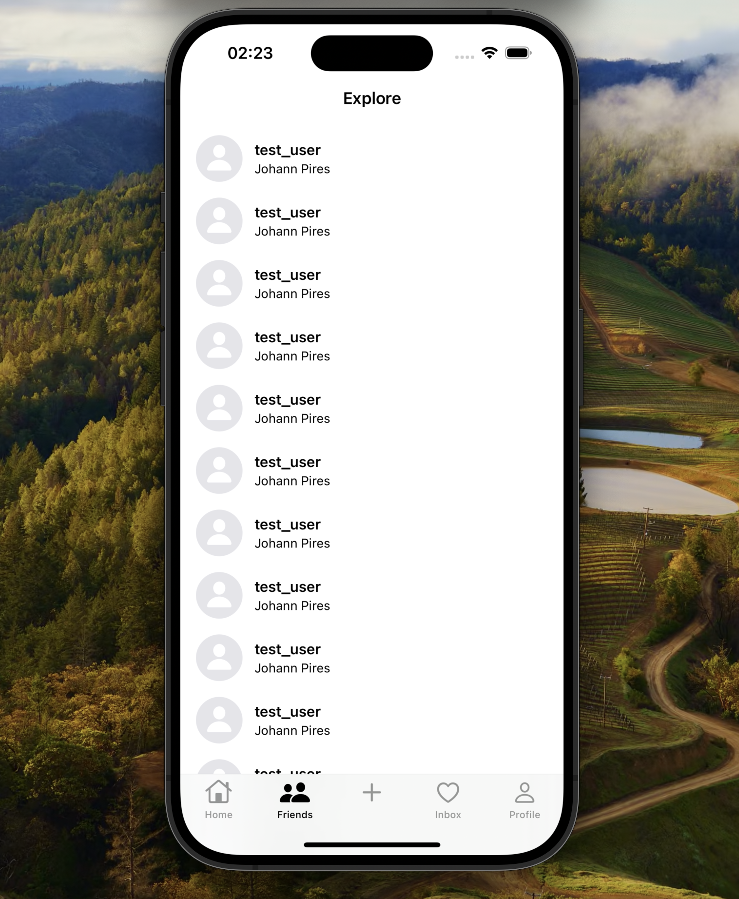
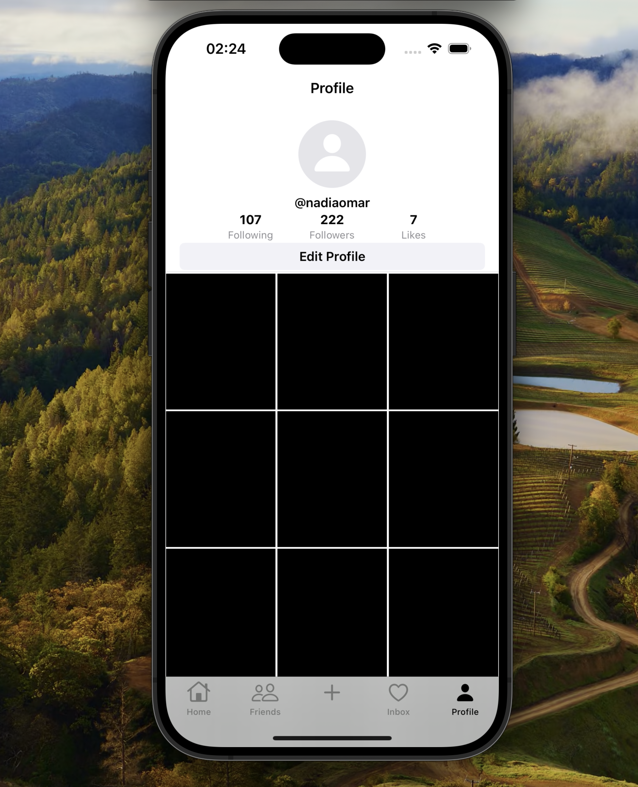

# TikTok Clone App

## Overview
This is a native iOS TikTok app clone fully developed in Swift using SwiftUI framework.

## Purpose
This application aims to replicate the popular TikTok experience on iOS devices using the SwiftUI framework. With a user-friendly interface TikTok has a focus on creating and sharing short-form videos. This TikTok clone, as the original version, provides a seamless and entertaining platform for users to showcase their creativity.

The primary goal of this project was to enhance my SwiftUI skills. At the same time, sharing it here makes it an excellent resource for developers looking to advance their proficiency with Apple's modern UI framework.

This app therefore, offers a comprehensive example of building a native iOS app using SwiftUI to mimic the design and all the main functionalities of the TikTok app. 

## :camera_flash: Screenshots
<!-- You can add more screenshots here if you like -->

&emsp;&emsp; 

&emsp;&emsp; 


## Key features and functionalities

* User authentication.
* Feed for discovering and watching videos.
* Interaction with videos through play and pause, likes, comments, and share buttons.
* TabView with scrollable and interactive Main Feed, Friends tab, Inbox for notifications, and User Profile.
* By examining the codebase and structure, developers can gain insights into SwiftUI best practices, software architecture, and how to integrate essential features for a social media app.

## Tecnologies
* Swift
* SwiftUI
* AVKit

## Author
Johann Pires (follow me on [LinkedIn](https://www.linkedin.com/in/johann-p-261961215/))

## License
```
The MIT License (MIT)

Copyright (c) 2023 Johann Pires

Permission is hereby granted, free of charge, to any person obtaining a copy of
this software and associated documentation files (the "Software"), to deal in
the Software without restriction, including without limitation the rights to
use, copy, modify, merge, publish, distribute, sublicense, and/or sell copies of
the Software, and to permit persons to whom the Software is furnished to do so,
subject to the following conditions:

The above copyright notice and this permission notice shall be included in all
copies or substantial portions of the Software.
